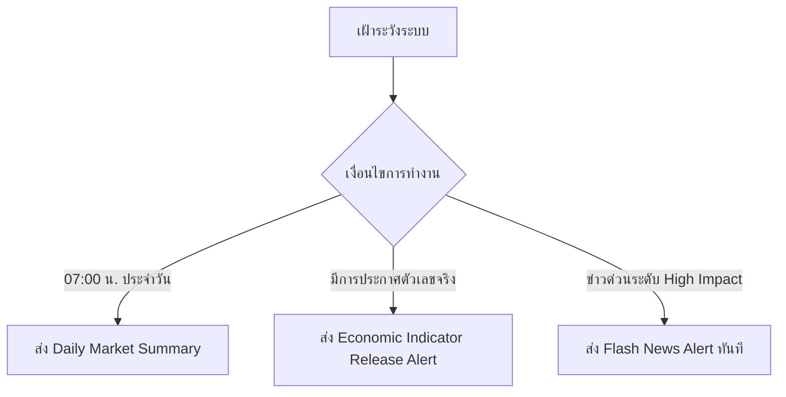

# ระบบตรวจสอบข่าวและวิเคราะห์ผลกระทบต่อการลงทุน (Market News Impact Monitor)

ทักษะนี้ช่วยให้ AI สแกนข่าวและตัวเลขเศรษฐกิจจากสำนักข่าวชั้นนำระดับโลก ประเมินผลกระทบ (Impact) ต่อสินทรัพย์เป้าหมาย (เน้น **ทองคำ XAUUSD**) แปลภาษาและเรียบเรียงภาษาไทยให้ถูกต้องตามบริบทการเงิน และส่งรายงานเข้า Telegram ทั้งแบบตามเวลา และแบบ Real-time Event Driven

---

## 1. ข้อกำหนดแหล่งข่าวและการแปลภาษา (Sources & Translation Rules)

### 1.1 การขยายแหล่งข่าว (Multi-Source Feeds)

ห้ามจำกัดเฉพาะ CNBC หรือ Yahoo Finance เท่านั้น ให้สแกนข่าวครอบคลุมแหล่งข่าวหลักดังนี้:

* **สำนักข่าวสายการเงินหลัก:** Bloomberg, Reuters, Financial Times (FT), MarketWatch, CNBC, Yahoo Finance
* **สำนักข่าวและข้อมูลปฏิทินเศรษฐกิจ:** Investing.com, Forex Factory, FXStreet
* **องค์กรนโยบายการเงิน:** Federal Reserve (Fed), European Central Bank (ECB), Bank of Japan (BOJ)

### 1.2 กฎเหล็กการแปลภาษาไทยผ่าน LLM (Language Quality Constraints)

1. **ห้ามใช้ระบบแปลอัตโนมัติแบบคำต่อคำ (No Raw Auto-Translate):** ป้องกันความซ้ำซ้อนหรือคำเพี้ยน
2. **ขัดเกลาศัพท์การเงินให้ตรงบริบท (Financial Contextual Translation):**
   * `warns of no-deal consequences` ➔ *เตือนถึงผลกระทบหากไม่สามารถบรรลุข้อตกลง*
   * `Hawkish / Dovish` ➔ *สายเหยี่ยว (สนับสนุนขึ้นดอกเบี้ย/คุมเข้ม) / สายพิราบ (สนับสนุนลดดอกเบี้ย/ผ่อนคลาย)*
   * `Bullish / Bearish` ➔ *มุมมองเชิงบวก (มีโอกาสปรับตัวขึ้น) / มุมมองเชิงลบ (มีโอกาสปรับตัวลง)*
3. **การแสดงผลชื่อเฉพาะ:** แสดงพาดหัวภาษาไทยที่เรียบเรียงสละสลวยเป็นหลัก และกำกับด้วยภาษาอังกฤษต้นฉบับในวงเล็บอย่างถูกต้อง
4. **ห้ามเดาตัวเลขหรือข้อมูล:** หาก Actual/Forecast/Previous ไม่พบข้อมูลที่ยืนยันได้ ให้ระบุว่าไม่พบข้อมูลแทนการเติมค่าประมาณ

---

## 2. เงื่อนไขและรอบการส่งรายงาน (Trigger & Dispatch System)



### 2.1 รายงานสรุปประจำวัน (Daily Scheduled Summary) — 07:00 น.

- **เวลาส่ง:** ทุกวัน เวลา 07:00 น. (UTC+7 / Asia-Bangkok)
- **เนื้อหา:** สรุปภาวะตลาดเมื่อคืน, ตารางปฏิทินเศรษฐกิจที่จะประกาศในวันนี้ และปัจจัยที่ควรติดตามสำหรับการเทรด
- **สินทรัพย์หลัก:** ทองคำ XAUUSD
- **หลักการ:** แยกข้อเท็จจริงจากการวิเคราะห์ และไม่สร้างข้อมูลข่าว/ตัวเลขขึ้นเอง

### 2.2 รายงานผลทันทีเมื่อตัวเลขเศรษฐกิจประกาศ (Economic Release Event Trigger)

**เงื่อนไข:** ทำงานเมื่อมีตัวเลขเศรษฐกิจระดับ Medium (2 ดาว) หรือ High (3 ดาว) ประกาศค่าจริง (Actual) เช่น CPI, Non-Farm Payrolls, Rate Decisions, PCE, PPI, GDP

**คำนวณส่วนต่าง:**

`Surprise Delta = Actual - Forecast`

สำหรับตัวเลขที่เป็นอัตรา, เปอร์เซ็นต์, จุดฐาน หรือหน่วยต่างกัน ให้คำนึงถึงหน่วยของตัวชี้วัดก่อนคำนวณ และแสดงหน่วยให้ชัดเจน

### 2.3 รายงานข่าวด่วนระดับวิกฤต (Real-time Flash News Trigger)

**เงื่อนไขตัวอย่าง:**

- ข่าวสงครามหรือความขัดแย้งทางภูมิรัฐศาสตร์
- คำสั่งคว่ำบาตรหรือมาตรการฉุกเฉิน
- แถลงการณ์ฉุกเฉินจากธนาคารกลางหรือรัฐบาล
- เหตุการณ์ที่อาจกระทบ USD / Treasury yields / risk sentiment / Gold
- ราคาทองคำผันผวนเกินประมาณ **$20–$30 ภายใน 15 นาที** โดยต้องตรวจสอบข้อมูลราคาและบริบทก่อนแจ้งเตือน

---

## 3. รูปแบบข้อความบน Telegram (Telegram Notification Templates)


### 3.1b Pre-Release Alert (ก่อนประกาศ ~30 นาที)

⏰ *[PRE-RELEASE] ใกล้ประกาศตัวเลขสำคัญ*

📌 *ตัวเลข:* [ชื่อ]  
🏛️ *ประเทศ/สกุลเงิน:* [USD/…] | ⏰ *เวลาประกาศ:* [HH:MM]  
🎚️ *ระดับผลกระทบ:* High / Medium

📈 *ข้อมูลก่อนประกาศ:*
• *คาดการณ์ (Forecast):* […]  
• *ครั้งก่อน (Previous):* […]  
• *ประกาศจริง (Actual):* รอประกาศ

💡 *บทวิเคราะห์เตรียมตัวต่อทองคำ XAUUSD:*  
[แนวทางเตรียมรับความผันผวน]

---
### 3.1 Economic Data Release

📊 *[ECONOMIC DATA RELEASE] ประกาศตัวเลขเศรษฐกิจ*

📌 *ตัวเลข:* [ชื่อตัวเลขเศรษฐกิจภาษาไทย] ([ภาษาอังกฤษ])  
🏛️ *ประเทศ/สกุลเงิน:* [เช่น USD / EUR] | ⏰ *เวลาประกาศ:* [HH:MM]  
📰 *แหล่งข้อมูล:* [แหล่งข้อมูลที่ตรวจสอบแล้ว]

📈 *ผลการประกาศ:*
• *ประกาศจริง (Actual):* [ค่าจริง]  
• *คาดการณ์ (Forecast):* [ค่าคาดการณ์]  
• *ครั้งก่อน (Previous):* [ค่าก่อนหน้า]  
• *Surprise Delta:* [ค่าและหน่วย]
• *Impact Score:* [0–100 จากขนาด Surprise]

💡 *บทวิเคราะห์ต่อทองคำ XAUUSD:*  
[สรุปผลกระทบต่อ DXY, Treasury yields และทองคำใน 1–2 ประโยค โดยแยกข้อเท็จจริงออกจากการตีความ]

---

### 3.2 Flash News Alert

🚨 *[FLASH NEWS] แจ้งเตือนข่าวด่วนส่งผลกระทบสูง*

📌 *หัวข้อข่าว:* [เรียบเรียงภาษาไทยให้ถูกต้องและสละสลวย]  
([Original Headline English])

🏛️ *สำนักข่าว:* [เช่น Bloomberg / Reuters / Financial Times] | ⏰ *เวลา:* [HH:MM]

💡 *บทวิเคราะห์ต่อทองคำ XAUUSD:*  
[วิเคราะห์ผลกระทบและความผันผวนที่อาจเกิดขึ้น โดยใช้ถ้อยคำเชิงความน่าจะเป็น ไม่ฟันธงทิศทาง]

⚠️ *โปรดเพิ่มความระมัดระวังและบริหารความเสี่ยงในพอร์ตการลงทุน*

---

## 4. กฎเหล็กในการดำเนินงาน (Safety & Execution Constraints)

### Multi-Source Verification

ข่าวสำคัญระดับ High Impact ควรตรวจสอบหรืออ้างอิงสำนักข่าวหลักอย่างน้อย 2 แห่งเมื่อทำได้ โดยเฉพาะข่าวที่มีผลต่อตลาดอย่างมีนัยสำคัญ

### Grammar & Spelling Audit

ข้อความภาษาไทยต้องผ่านการตรวจสอบคำแปล ชื่อเฉพาะ ตัวเลข หน่วย และตัวสะกดก่อนส่ง Telegram

### Accuracy on Data

- แสดง Actual, Forecast และ Previous ตามข้อมูลที่ตรวจสอบได้จริง
- ห้ามคาดเดาตัวเลขล่วงหน้า
- หากแหล่งข้อมูลขัดแย้งกัน ให้ระบุความขัดแย้งและใช้แหล่งข้อมูลที่น่าเชื่อถือกว่า
- เก็บ timestamp และ timezone ให้ชัดเจน
- ต้องแยก `Actual` ออกจาก `Forecast` และ `Previous` อย่างชัดเจน

### Deduplication

ข่าวหรือ Economic Release เดียวกันที่มาจากหลายแหล่งต้องรวมเป็นเหตุการณ์เดียว ไม่ส่งซ้ำโดยไม่จำเป็น และควรเก็บแหล่งอ้างอิงที่ใช้ตรวจสอบไว้

### Fallback Safety

**ห้ามส่ง fallback/sample calendar data เป็นข้อมูลเศรษฐกิจจริง** หาก primary data source ใช้งานไม่ได้และไม่มีข้อมูลที่ตรวจสอบได้ ให้หยุดการส่ง event นั้นและแจ้งสถานะระบบแทน

### Trading Safety

ข้อความวิเคราะห์เป็นข้อมูลประกอบการตัดสินใจ ไม่ใช่คำสั่งซื้อขาย และไม่ควรฟันธงว่าทองคำจะขึ้นหรือลงจากตัวเลขเดียวโดยไม่พิจารณา DXY, yields, expectations และ market positioning

---

## 5. Pipeline มาตรฐาน

```
Economic Calendar / News Sources
            ↓
Source Validation
            ↓
Date & Timezone Normalization
            ↓
Actual / Forecast / Previous Validation
            ↓
Impact Classification
            ↓
Surprise Delta / Context Analysis
            ↓
XAUUSD Impact Analysis
            ↓
Thai Contextual Translation
            ↓
Grammar / Spelling / Number Audit
            ↓
Deduplication
            ↓
Telegram Formatter
            ↓
Telegram Dispatch
            ↓
Logging / Monitoring
```

---

## 6. Production Integration

ในโปรเจกต์ Gold Trading News Automation ให้ skill นี้ทำหน้าที่เป็น **logic specification** สำหรับระบบจริง โดยโค้ด production ควรใช้โมดูลที่แยกหน้าที่ เช่น:

- `src/calendar_scanner.py` — Economic Calendar ingestion และ normalization
- `src/news_scanner.py` — ข่าวจากหลายแหล่ง
- `src/impact_analyzer.py` — Impact / Surprise / Gold Impact
- `src/telegram_bot.py` — Telegram delivery
- `src/economic_calendar_e2e.py` — End-to-End validation
- `.github/workflows/economic_calendar_e2e.yml` — GitHub Actions schedule/test

**ข้อสำคัญ:** หลีกเลี่ยงการแทนที่ `src/main.py` production เดิมด้วยสคริปต์ scheduler แบบ standalone หากจะทำให้โมดูลที่มีอยู่, E2E test หรือ workflow เดิมเสียความเข้ากันได้ ควร integrate logic ใหม่เข้ากับ architecture เดิมแทน

---

## 7. E2E Acceptance Criteria

ระบบ Economic Calendar ถือว่าผ่าน E2E เมื่อ:

1. ดึงข้อมูล event จากแหล่งข้อมูลได้
2. ตรวจสอบว่า event อยู่ในวันที่/Timezone ที่ถูกต้อง
3. คัดเฉพาะ Medium/High ตามกติกา
4. ตรวจสอบ Actual/Forecast/Previous
5. คำนวณ Surprise Delta ได้เมื่อมีข้อมูลครบ
6. วิเคราะห์ผลกระทบต่อ XAUUSD
7. เรียบเรียงภาษาไทยและตรวจ spelling
8. จัดรูปแบบ Telegram ได้ถูกต้อง
9. ส่ง Telegram สำเร็จ
10. Log ผลลัพธ์เพื่อให้ตรวจสอบย้อนหลังได้

หากไม่มีข้อมูลที่ยืนยันได้ **ต้องไม่ส่งข้อมูลตัวอย่างหรือ fallback เป็นข้อมูลจริง**

---

## 8. Daily / Release / Flash Operating Modes

| Mode | Trigger | Output |
|---|---|---|
| Daily | 07:00 Asia/Bangkok | Market Summary + Today's Economic Calendar |
| Release | Actual Data Release | Economic Data Release Alert |
| Flash | High-Impact Breaking News | Flash News Alert |
| E2E Test | Manual / GitHub Actions | Test message + pipeline validation |
